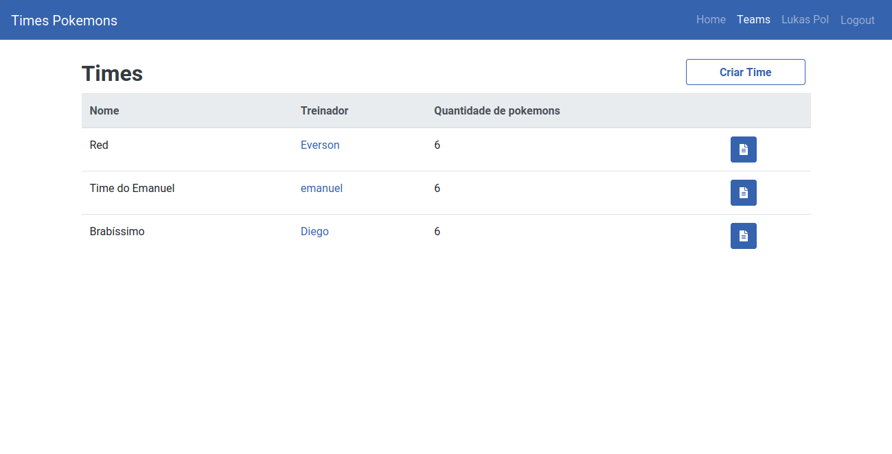
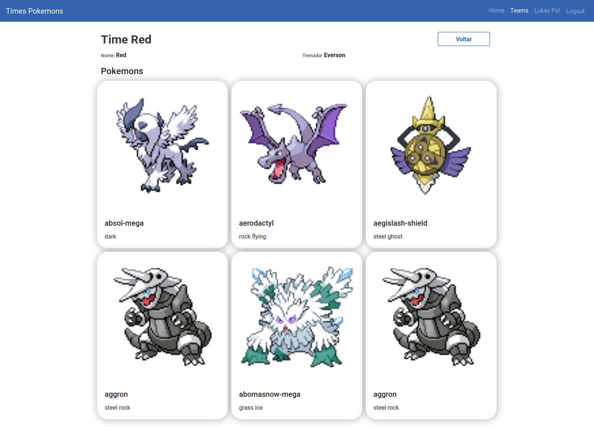

# Team Pokedex

Click here to visit: [TeamPokedex](https://team-pokedex.herokuapp.com)

You can register yours teams and shared with yours friends;
You can see all teams of another trainers;
And now, **Who will be the strongest?**

## Pre-requisites

**Recommend**
- Docker and Docker Composer

or
- Ruby ~> 2.7.2
- Rails ~> 6.0.3
- Postgres ~> 12.6
- Node ~> 13.12.0
- Yarn ~> 1.22.5
- Webpacker

## Setup project with docker

1. `$ git clone https://github.com/LukasPol/team-pokedex.git`
1. `$ cd team-pokedex`
1. `$ cp .env.sample .env`
1. `$ docker-compose build`
1. `$ docker-compose up` (you can use the flag `-d`)
1. `$ docker-compose exec app bash`
1. `$ rake db:create`
1. `$ rake db:migrate`
1. `$ rails s -b 0.0.0.0`

Open in browser [http://localhost:3000](http://localhost:3000)

## Setup project without docker
1. `$ git clone https://github.com/LukasPol/team-pokedex.git`
1. `$ cd team-pokedex`
1. `$ cp .env.sample .env`
1. Set your username and your password and your host database
1. `$ bundle install`
1. `$ yarn install`
1. `$ rake db:create`
1. `$ rake db:migrate`
1. `$ rake db:seed`
1. `$ rails s`

Open in browser [http://localhost:3000](http://localhost:3000)

## Services

I create two services in a class `GetPokedex`:

1. First service get all pokemons from [pokeapi](https://pokeapi.co/) and sort by name and return results
2. Second service get one pokemon from [pokeapi](https://pokeapi.co/), receive a parameter what is name pokemon, and return result

## Run tests

1. `rspec spec/`

## Gems used
- [Devise](https://github.com/heartcombo/devise) for authetication
- [Pundit](https://github.com/varvet/pundit) for authorization
- [rest-client](https://github.com/rest-client/rest-client) for consume api

**tests**
- [database_cleaner](https://github.com/DatabaseCleaner/database_cleaner) to erase tests database
- [Factories](https://github.com/thoughtbot/factory_bot) to help with the tests
- [FFaker](https://github.com/ffaker/ffaker) to generate random faker
- [Rspec](https://github.com/rspec/rspec-rails) for tests
- [rubocop-rails](https://github.com/rubocop/rubocop) and [rubocop-performance](https://github.com/rubocop/rubocop-performance) for help me with good pratices :D